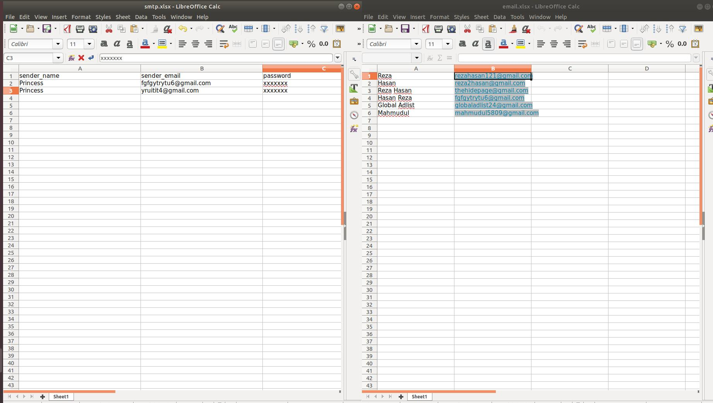

# Send Bulk Mail Using Python

    Create two excel file named smtp.xlsx and email.xlsx
    Add image named attachment.jpg for attachment
    create a file which contains message named body.txt
    File Structure is given below.

File Structure Image:

<h2> To run the program use the following command </h2>
<code>python bulk_mail.py</code>

<h2>Author</h2>
<blockquote>
  Mahmudul Hassan 
  Email: mahmudul.hassan240@gmail.com
</blockquote>

    <h3>========Thank You !!!=========</h3>

